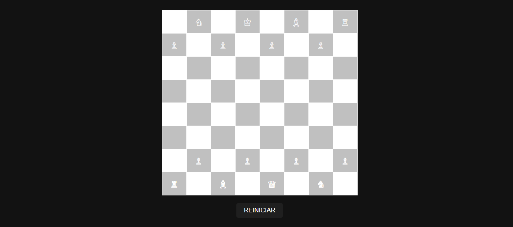

# JOGO DE XADREZ
👨‍🏫JOGO EM HTML/CSS/JS.

   

## DESCRIÇÃO:
O jogo de xadrez é um jogo de tabuleiro estratégico para dois jogadores. Cada jogador controla um conjunto de 16 peças: um rei, uma rainha, duas torres, dois bispos, dois cavalos e oito peões. O objetivo do jogo é dar xeque-mate ao rei adversário, ou seja, colocar o rei do oponente em uma posição de ataque iminente que não pode ser evitada.

## COMO JOGAR?
1. **Configuração Inicial:**
   - O tabuleiro é composto por 64 casas dispostas em uma grade de 8x8. Cada jogador inicia com suas peças dispostas na fileira mais próxima a eles.
   - As peças são organizadas da seguinte forma:
     - **Linha 1 (ou 8 para o adversário):** Torre, Cavalo, Bispo, Rainha, Rei, Bispo, Cavalo, Torre.
     - **Linha 2 (ou 7 para o adversário):** Todos os peões.

2. **Movimento das Peças:**
   - **Rei:** Move-se uma casa em qualquer direção (horizontal, vertical ou diagonal).
   - **Rainha:** Move-se qualquer número de casas em qualquer direção (horizontal, vertical ou diagonal).
   - **Torre:** Move-se qualquer número de casas horizontal ou verticalmente.
   - **Bispo:** Move-se qualquer número de casas diagonalmente.
   - **Cavalo:** Move-se em forma de "L" (duas casas em uma direção e uma casa perpendicular).
   - **Peão:** Move-se uma casa para frente (ou duas casas se estiver na sua posição inicial). Pode capturar peças adversárias movendo-se uma casa diagonalmente para frente. Quando um peão alcança a linha final do adversário, ele pode ser promovido a outra peça (exceto rei), geralmente a uma rainha.

3. **Objetivo do Jogo:**
   - O objetivo é dar xeque-mate no rei adversário. O xeque-mate ocorre quando o rei está sob ataque e não há nenhum movimento legal que possa ser feito para evitar o ataque.
   - Também é possível ganhar por desistência do adversário ou empate em casos especiais, como falta de peças suficientes para dar mate.

4. **Regras Adicionais:**
   - **Roque:** Movimento especial que envolve o rei e uma torre. O rei se move duas casas em direção à torre, e a torre pula por cima do rei para sua nova posição. Esse movimento é válido somente se o rei e a torre ainda não se moveram, não há peças entre eles e o rei não está em xeque.
   - **En Passant:** Se um peão move duas casas em seu primeiro movimento e termina ao lado de um peão adversário, o adversário pode capturar o peão "em passant" na próxima jogada.
   - **Promoção:** Quando um peão alcança a fileira final oposta, ele pode ser promovido a qualquer outra peça, geralmente uma rainha.

5. **Reiniciar o Jogo:**
   - Você pode reiniciar o jogo clicando no botão "REINICIAR", que irá restaurar a configuração inicial das peças no tabuleiro.

- [LEIA AS REGRAS](https://comojogarxadrez.com.br/posicao-inicial-das-pecas-no-tabuleiro-de-xadrez.html)

## NÃO SABE?
- Entendemos que para manipular arquivos em `HTML`, `CSS` e outras linguagens relacionadas, é necessário possuir conhecimento nessas áreas. Para auxiliar nesse aprendizado, oferecemos cursos gratuitos disponíveis:
* [CURSO DE HTML E CSS](https://github.com/VILHALVA/CURSO-DE-HTML-E-CSS)
* [CURSO DE JAVASCRIPT](https://github.com/VILHALVA/CURSO-DE-JAVASCRIPT)
* [CONFIRA MAIS CURSOS](https://github.com/VILHALVA?tab=repositories&q=+topic:CURSO)

## CREDITOS:
- [PROJETO CRIADO PELO "paulobirocchi"](https://github.com/paulobirocchi/XadrezJS)
- [PROJETO EDITADO PELO VILHALVA](https://github.com/VILHALVA)
